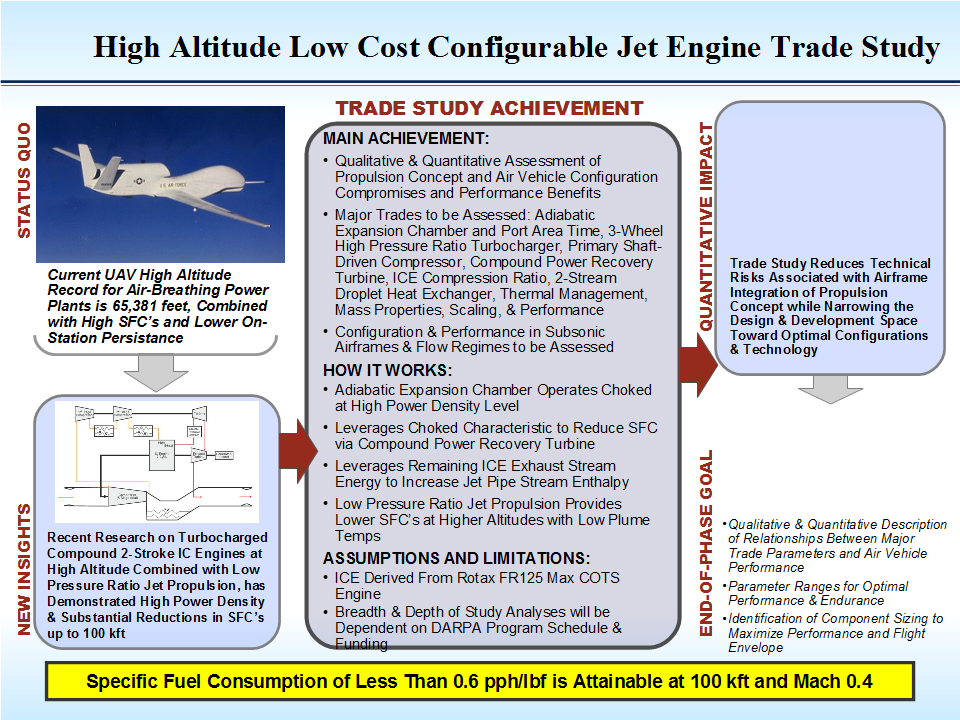
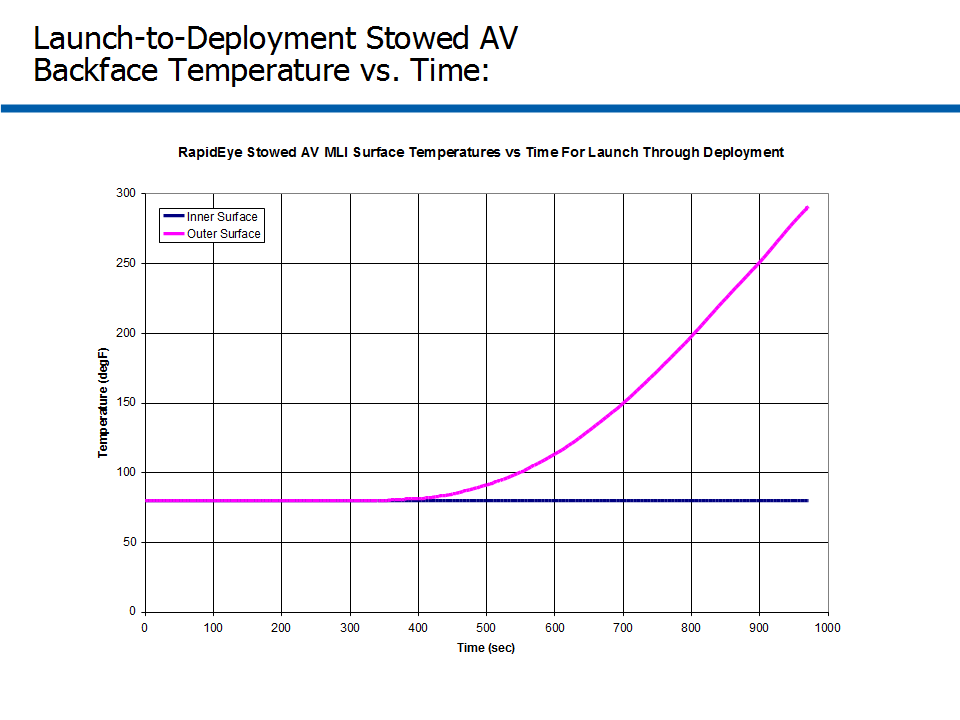
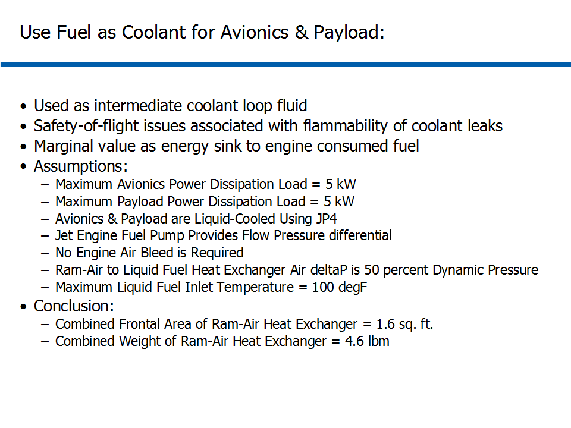
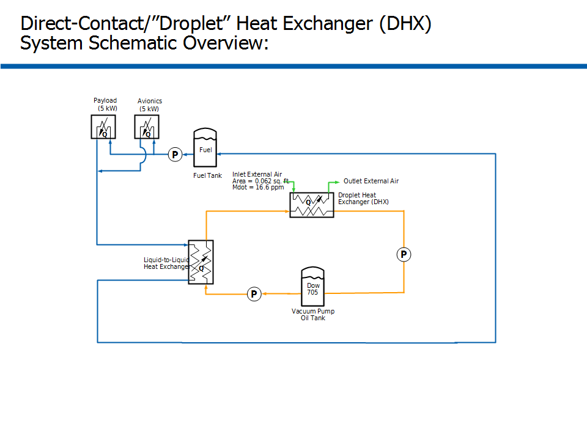
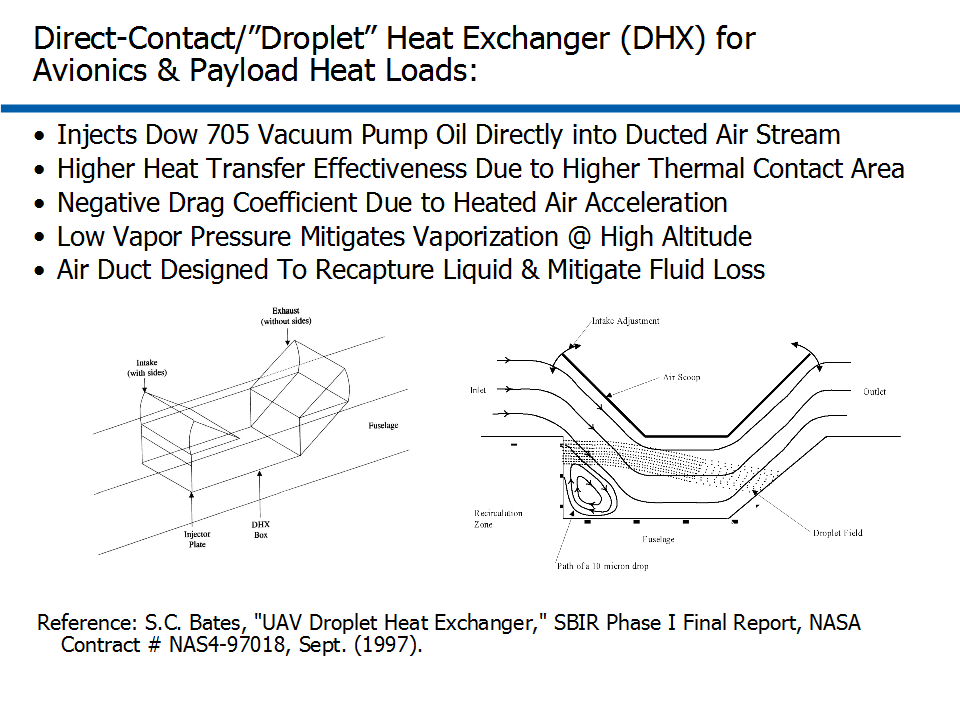
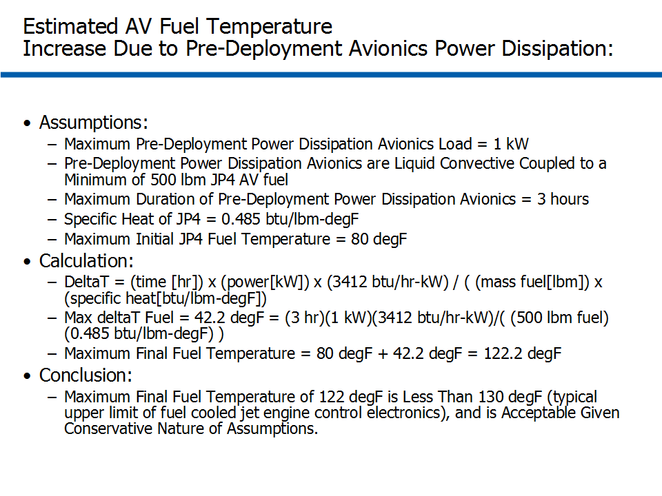
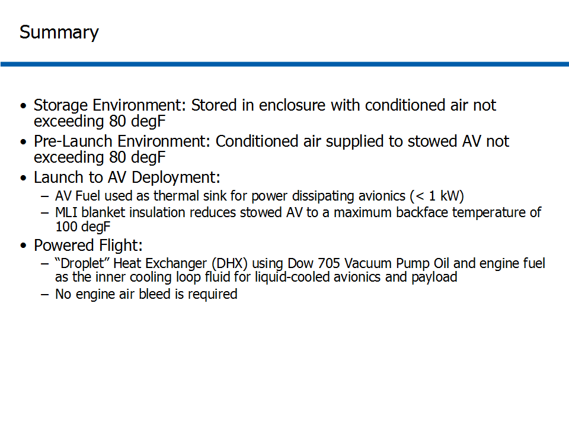

# ========================================
# ICBM Injection of Deployable UAV System Thermal Analysis:
# ========================================

## I. Design Context Overview:

## 
## 
## II. Launch-to-Deployment Stowed UAV Backface Temperature vs. Time:

## 
## 
## III. Givens & Assumptions for System Thermal Analysis:

## 
## 
## IV. System Thermal Schematic:

## 
## 
## V. Overview of Direct-Contact Heat Exchanger:

## 
## 
## VI. Estimated Stowed UAV Fuel Temperature Due to Pre-Deployment Heat Loads:

## 
## 
## VII. Summary of System Thermal Analysis During (3) Operational Phases:

